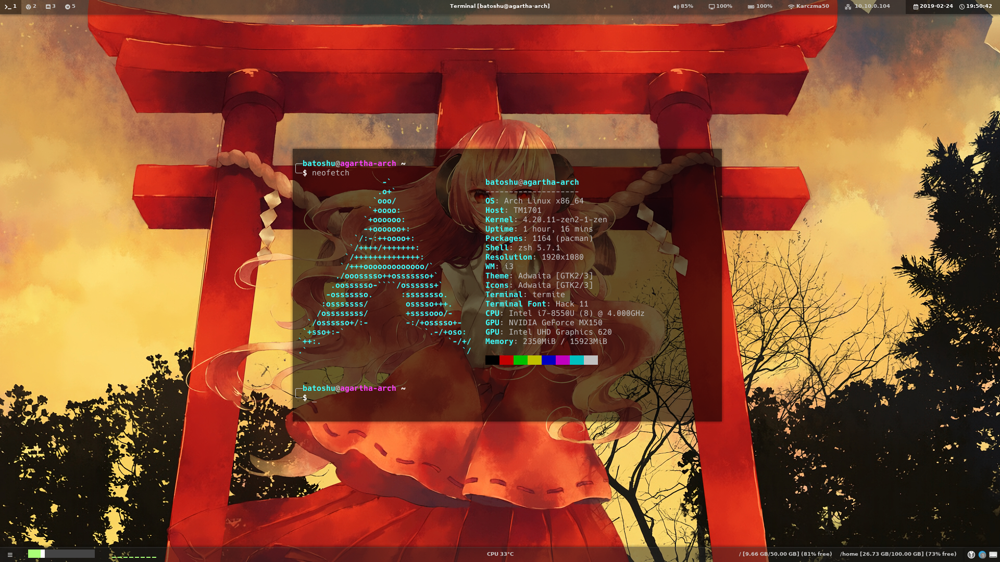

# My Arch linux setup
This repo contains my Arch Linux setup, i.e. i3 config, polybar config, zsh config and more...

I've created this repository to share my setup with others, and make backup of it.
