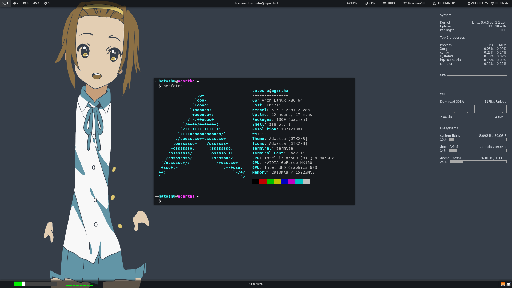

# My Arch linux setup
This repo contains my Arch Linux setup, i.e. i3 config, polybar config, zsh config and more...


I've created this repository to share my setup with others, and make backup of it.

## Dependencies
Packages (from Arch Linux repositories) needed by my dotfiles:
```
xorg		# X Server
xorg-xinit	# For startx
i3		# i3-gaps, i3-wm and i3lock at least
compton		# For transparenct
polybar		# AUR package; For top and bottom panels
conky		# System info on desktop

zsh		# Shell
termite		# Terminal
jgmenu		# App launcher
dunst		# Notyfication server
feh		# For wallpapers
scrot		# For taking screenshots
xclip		# For copying taken screenshots to clipboard

udiskie		# For auto-mounting external drives
rclone		# For mounting cloud drives
imagemagick	# For blur effect on i3lock image

aurman		# AUR package; For installing AUR packages

vim		# Text editor
google-chrome	# AUR package; Internet Browser
spotify		# AUR package; Music player
discord		# AUR package; Communicator
```

Fast install commands:
```
pacman -Syu --noconfirm git xorg xorg-xinit i3 compton conky zsh termite jgmenu dunst feh scrot xclip udiskie rclone imagemagick vim
cd /tmp
git clone https://aur.archlinux.org/aurman.git
cd aurman/
makepkg -si
cd ~
rm -rf /tmp/aurman
aurman -Syu --noconfirm polybar vim google-chrome spotify discord
```
